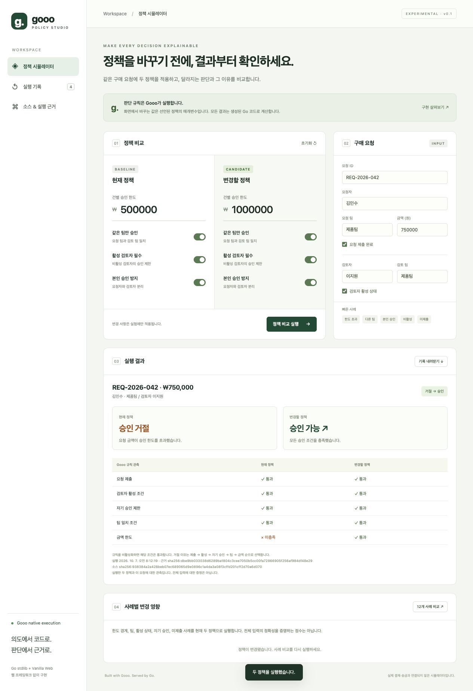
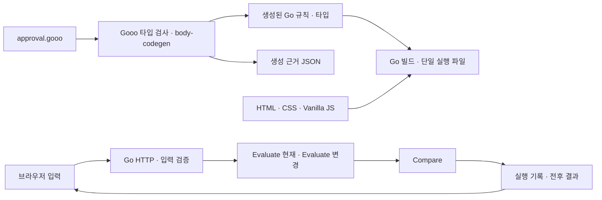

# Gooo Policy Studio

**승인 정책을 바꾸기 전에, 같은 요청의 판단이 어떻게 달라지는지 확인하는 웹 시뮬레이터.**

구매 요청과 검토자 정보를 입력하고 현재 정책/변경할 정책을 비교합니다. 승인 여부, 최초 거절 이유, 다섯 규칙의 통과 여부를 표시하고 실제 실행의 입력·결과·소스 해시를 JSON으로 보관합니다.

업무 규칙은 **Gooo**, 서버와 실행 연결은 **Go 표준 라이브러리**, 화면은 **HTML/CSS/Vanilla JavaScript**로 구현했습니다. 웹 프레임워크, UI 라이브러리, npm 의존성, CDN, 외부 폰트가 없습니다. `go.mod`에도 외부 런타임 의존성이 없습니다.



## 바로 실행하기

Go **1.26 이상**이 있으면 Gooo 설치 없이 실행됩니다. 생성된 코드와 웹 파일을 저장소에 포함했습니다.

```sh
git clone https://github.com/kimjooyoon/gooo-policy-studio.git
cd gooo-policy-studio
go run ./cmd/server
```

[http://127.0.0.1:8080](http://127.0.0.1:8080)에 접속하세요. 기본 요청은 750,000원이며 현재 한도 500,000원에서는 거절, 변경 한도 1,000,000원에서는 승인됩니다.

```sh
go build -trimpath -o bin/policy-studio ./cmd/server
./bin/policy-studio -addr 127.0.0.1:8080
```

`go:embed`로 웹 파일·Gooo 소스·생성 코드·생성 근거를 실행 파일에 포함합니다. 실행 파일 하나를 다른 폴더로 옮겨도 동작합니다. [Releases](https://github.com/kimjooyoon/gooo-policy-studio/releases)에서 OS별 실행 파일을 받을 수 있습니다.

## 화면에서 할 수 있는 일

1. **정책 비교:** 건별 금액 한도, 같은 팀 제한, 활성 검토자 필수, 본인 승인 방지를 현재/변경 정책에 각각 설정합니다.
2. **구매 요청:** 요청자·팀·금액·제출 여부, 검토자·팀·활성 상태를 입력합니다. 한도 초과/다른 팀/본인 승인/비활성/미제출 프리셋을 제공합니다.
3. **실행 결과:** 두 정책의 승인 여부와 이유, 모든 조건의 통과 여부를 나란히 표시합니다. 입력을 바꾸면 이전 결과를 무효화하고 재실행을 안내합니다.
4. **사례 영향:** 12개 사례를 실제 API로 실행해 승인 상태가 바뀐 사례를 표시합니다. 각 사례의 상세 결과를 열 수 있습니다.
5. **실행 기록:** 최근 30개를 브라우저 `localStorage`에 저장합니다. JSON을 내려받거나 가져와 재실행합니다. 서버에는 요청·기록을 저장하지 않습니다.
6. **소스 & 근거:** 실행 파일에 들어 있는 `.gooo`, 생성된 Go, 컴파일러 JSON 기록을 열고 내려받습니다.

기본 정책의 금액은 정수 원(KRW)입니다. 외부 효과를 실행하지 않으며 실제 구매 승인·결재·송금 서비스가 아닙니다.

## Gooo와 Go가 각각 구현한 부분

| 기능 | 원본 소유자 | 파일 | 구체적 역할 |
|---|---|---|---|
| 도메인 스키마 | Gooo | [`policy/approval.gooo`](policy/approval.gooo) | Request, Reviewer, Policy, Decision, Change의 필드·타입·안정 ID |
| 승인 조건 | Gooo | 같은 파일의 `Evaluate` | 제출, 활성, 자기 승인, 팀, 한도 조건의 계산 |
| 거절 이유 | Gooo | `Evaluate` | 다중 실패에서 최초 이유의 우선순위 결정 |
| 조건별 관측 | Gooo | `Evaluate` | `submitted_ok` 등 5개 불리언 결과를 반환 |
| 정책 변화 분류 | Gooo | `Compare` | 새 승인/새 거절/승인 상태 유지, 이유 변경 여부 |
| 실제 업무 규칙 실행 | Gooo에서 생성된 Go | [`rules_generated.go`](internal/policy/rules_generated.go) | Gooo가 타입 검사·생성한 함수가 네이티브 Go 코드로 실행 |
| 컴파일러 연결 | 수작업 Go | [`cmd/generate/main.go`](cmd/generate/main.go) | 두 활동을 컴파일, 타입 중복 제거, 생성 영역 보존, 기록 저장 |
| JSON 타입 전달 | 메타데이터에서 생성된 Go | [`bridge_generated.go`](internal/policy/bridge_generated.go) | 사람이 읽는 HTTP 타입 ↔ 안정 ID 기반 생성 타입, 업무 조건 없음 |
| API 입출력 타입 | 수작업 Go | [`policy.go`](internal/policy/policy.go) | HTTP 경계용 구조체, 금액 범위·문자열 입력 검증 |
| 실행 기록·재실행 | 수작업 Go | 같은 파일 | 소스/코드/기록 SHA-256 계산, 현재 출처 비교, 입력 재실행과 결과 비교 |
| HTTP·JSON 경계 | 수작업 Go | [`server.go`](internal/httpapp/server.go), [`json.go`](internal/httpapp/json.go) | 라우팅, 크기 제한, 필수 필드·null·중복 키·타입 검증, 동일 출처 제한 |
| 서버 수명 | 수작업 Go | [`cmd/server/main.go`](cmd/server/main.go) | 주소 설정, HTTP 시간 제한, 종료 신호·graceful shutdown |
| 정적 파일 배포 | Go | [`web/embed.go`](web/embed.go) | HTML/CSS/JS를 바이너리에 포함하고 표준 파일 서버로 제공 |
| 화면 구조·스타일 | HTML/CSS | [`index.html`](web/index.html), [`style.css`](web/style.css) | 반응형 폼, 정책 카드, 결과 표, 모바일 내비게이션 |
| 화면 동작 | Vanilla JS | [`app.js`](web/app.js) | 폼 수집, API 호출, 결과 표시, 프리셋·기록·파일 내보내기 |
| 독립 기대값 검증 | 수작업 Go 테스트 | [`policy_test.go`](internal/policy/policy_test.go) | 승인 조건의 독립 오라클, 이유·경계·변경·재실행 검증 |

**Go나 JavaScript에서 승인 규칙을 다시 구현하지 않습니다.** 브라우저는 표시 문구와 사례 입력을 만들지만 승인 여부를 계산하지 않습니다. 수작업 Go는 입력을 검증하고 생성 함수를 호출합니다. 테스트에만 별도의 기대값 오라클이 있습니다.

### Gooo 구현 상세

원본의 `Evaluate(Request, Reviewer, Policy) -> Decision`은 세 레코드를 받습니다.

```text
amountOK    = request.amount <= policy.limit
teamOK      = !policy.same_team || request.team == reviewer.team
reviewerOK  = !policy.active_reviewer || reviewer.active
selfOK      = !policy.prevent_self || request.requester != reviewer.key
submittedOK = request.submitted
approved    = submittedOK && reviewerOK && selfOK && teamOK && amountOK
```

위 조건은 설명용 표현이며 실제 구현은 `.gooo`의 `computes` 안에 있습니다. 비활성화한 규칙은 통과하며 제출 조건은 항상 필수입니다. 여러 조건이 실패하면 **미제출 → 검토자 비활성 → 본인 승인 → 팀 불일치 → 금액 초과** 순으로 최초 거절 이유를 정합니다. 첫 실패만 이유로 선택하되 다른 조건의 관측도 모두 보존합니다.

`Compare(Decision, Decision) -> Change`는 승인 상태를 비교해 `NEWLY_APPROVED`, `NEWLY_DENIED`, `UNCHANGED`를 반환합니다. 승인 상태가 같아도 거절 이유가 바뀌면 `reason_changed`가 true입니다.

엔티티와 필드에는 `policy://…` 안정 ID가 있습니다. 컴파일러는 ID에서 생성한 Go 타입/필드 이름을 사용하고 JSON 태그는 읽기 쉬운 Gooo 필드 이름을 유지합니다. 예를 들어 `amount`는 Go `int64`, `active`는 `bool`로 생성됩니다. 상세 이름은 생성 파일에서 확인할 수 있습니다.

이 버전은 **명시적으로 작성한 순수 활동 본문을 보존하는 결정론 생성 경로**를 사용합니다. 모델 추론, 학습, 후보 합성은 실행하지 않습니다. 생성 기록의 `PASS`는 해당 컴파일러의 제한된 타입 검사·생성·재생 검사 결과이며 모든 입력의 업무 정확성을 뜻하지 않습니다.

### Go 구현 상세

- `net/http`의 메서드별 `ServeMux` 라우트와 `http.FileServerFS`로 서버를 구성합니다.
- `encoding/json`으로 전달하며 생성 어댑터는 JSON 필드명을 통해 입출력 타입을 연결합니다. 이 방식은 직접 필드 매핑보다 비용이 있지만 ID 기반 이름에 의존하는 수작업 코드를 없앱니다. 성능 우위를 주장하지 않습니다.
- HTTP 입력은 필수 필드가 모두 있어야 합니다. 중복 키, null, 알 수 없는 필드, 소수 금액, JSON 객체 여러 개, 128KiB 초과 입력은 거부합니다.
- 금액/한도는 `0..9,000,000,000,000` 정수입니다. JavaScript 안전 정수 범위 안에서 브라우저와 Go 값을 일치시킵니다. 이름·팀·요청 ID는 공백만 있는 값과 120바이트 초과 값을 거부합니다.
- 기록은 JSON을 정규 Go 구조체로 직렬화해 SHA-256을 계산합니다. ID 계산 시 ID 자신은 빈 문자열입니다. 시각은 UTC RFC3339Nano이며 화면에서 브라우저 현지 시각으로 표시합니다.
- 재실행 시 스키마·범위·기록 해시, 현재 Gooo 소스/생성 코드 해시, 컴파일러 출처와 결과를 확인합니다. 새 기록에는 새 실행 시각과 ID가 부여됩니다.
- 해시는 **전자서명이 아닙니다**. 파일 작성자가 입력과 해시를 함께 바꿀 수 있습니다. 따라서 이는 발급자 인증이 아닌 내용 일관성과 현재 코드에서의 재현 확인입니다.
- 기본은 `127.0.0.1` 바인딩입니다. 다른 호스트로 노출하려면 `-addr`를 지정하며 인증·TLS·영구 감사 저장은 이 프로젝트 범위 밖입니다.

### 화면 구현 상세

외부 라이브러리 없이 시맨틱 HTML, CSS Grid/Flex와 DOM 이벤트를 사용합니다. 체크박스가 정책 토글 역할을 하며 네이티브 폼 검증을 사용합니다. 요청자 입력은 HTML에 넣기 전에 이스케이프하고 소스 표시는 `textContent`로 처리합니다. 서버는 CSP로 자체 스크립트·스타일만 허용합니다.

모바일에서는 사이드바가 상단 메뉴로 전환되고 정책/요청 카드가 한 열로 배치됩니다. 표는 필요한 영역만 가로 스크롤합니다. `aria-live` 실행 알림, 라벨 연결, 키보드 포커스와 reduced-motion 설정을 제공합니다.

실행 중 입력이 바뀌면 이전 요청 결과를 현재 폼의 결과로 표시하지 않습니다. 이전 요청의 실행은 기록에 남기고 재실행을 안내합니다. 사례 비교 도중 정책이 바뀌어도 이전 정책의 표를 새 정책 결과로 표시하지 않습니다.

## 소스에서 실행까지



1. Gooo의 `Evaluate`, `Compare`를 각각 `body-codegen --json`으로 생성합니다.
2. 생성 도구가 중복 엔티티 타입을 한 번만 포함하고 원래 생성 영역 마커와 함수 본문을 유지합니다.
3. 컴파일러의 `record_types` 메타데이터로 전달 어댑터를 생성합니다.
4. 원본/생성 코드/어댑터 해시와 컴파일러 정체성·활동별 원본 응답을 저장합니다.
5. 일반 Go 빌드가 규칙과 웹 파일을 실행 파일에 포함합니다. 서버 실행 중 컴파일러·모델·셸 명령을 호출하지 않습니다.
6. 브라우저 요청마다 두 번의 `Evaluate`와 한 번의 `Compare`를 실제로 실행합니다.

웹 UI에서 수정하는 것은 **정책 매개변수**입니다. Gooo 본문이나 규칙 우선순위를 수정하려면 아래 재생성·테스트·재빌드가 필요합니다. 브라우저에서 임의 Gooo/Go 코드를 컴파일하는 기능은 없습니다.

## Gooo 코드 재생성

컴파일러 리비전은 [`tools/compiler-version.txt`](tools/compiler-version.txt)의 **`49f5a8c46507bed813a1eae4f7b10e7436eeb3ba`**로 고정합니다. 컴파일러 자체의 요구사항은 **Go 1.27.1**입니다. `GOTOOLCHAIN=auto` 환경에서는 Go가 해당 도구체인을 준비합니다.

깨끗한 Git 체크아웃에서 컴파일러를 빌드해야 버전 기록에 정확한 소스 SHA가 들어갑니다. `go install …@SHA`로 빌드하면 모듈 버전은 고정돼도 이 컴파일러가 VCS 출처를 `UNBOUND_LOCAL_SOURCE`로 기록할 수 있으므로, 이 도구는 그런 컴파일러를 거부합니다.

```sh
mkdir -p .tools
git clone --filter=blob:none https://github.com/kimjooyoon/meta-ontology-go.git .tools/compiler
git -C .tools/compiler checkout "$(cattools/compiler-version.txt)"
go -C .tools/compiler build -o "$(pwd)/.tools/gooo" ./cmd/gooo

go run ./cmd/generate --compiler .tools/gooo
go test -race ./...
go vet ./...
```

프로젝트 루트에서 실행하세요. 도구는 외부 `GOOO_LAYA_URL` 설정을 전달하지 않으며 결정론 경로를 유지합니다. 수정한 컴파일러는 출처 SHA가 고정 리비전과 일치하지 않아 거부됩니다.

다음 명령은 파일을 쓰지 않고 Gooo에서 다시 생성한 코드·어댑터·내장 소스가 현재 파일과 같은지 확인합니다.

```sh
go run ./cmd/generate --compiler .tools/gooo --check
```

`generation.json`에는 생성 환경/컴파일러 기록이 포함되므로 다른 OS에서 JSON 전체의 바이트 일치를 요구하지 않습니다. `--check`는 실행 코드와 소스 사본의 바이트 일치를 검증하고 현재 컴파일러의 PASS·소스 SHA를 확인합니다. 저장된 근거 JSON의 파일 연결은 별도의 Go 테스트가 검사합니다.

생성 도구가 관리하는 파일은 다음과 같습니다. 직접 수정하지 마세요.

- `internal/policy/rules_generated.go`: 컴파일러가 생성한 레코드와 두 함수
- `internal/policy/bridge_generated.go`: 메타데이터 기반 타입 전달 어댑터
- `internal/policy/approval.gooo`, `generated.txt`: 실행 파일에 넣는 원본/생성 코드 사본
- `evidence/generation.json`, `internal/policy/generation.json`: 활동별 원본 응답과 해시·컴파일러 정체성

## API

| 메서드 | 경로 | 역할 |
|---|---|---|
| GET | `/api/source` | 내장 Gooo·생성 Go·생성 근거 |
| POST | `/api/simulate` | 요청·검토자·두 정책 실행, 실행 기록 반환 |
| POST | `/api/replay` | 실행 기록의 출처와 내용 검증 후 실제 재실행 |
| GET | `/`, `/app.js`, `/style.css` | 내장 정적 화면 |

POST는 `Content-Type: application/json`을 사용합니다.

```sh
curl http://127.0.0.1:8080/api/simulate \
  -H 'Content-Type: application/json' \
  -d '{
    "request":{"key":"REQ-1","requester":"김민수","team":"제품팀","amount":750000,"submitted":true},
    "reviewer":{"key":"이지원","team":"제품팀","active":true},
    "before":{"limit":500000,"same_team":true,"active_reviewer":true,"prevent_self":true},
    "after":{"limit":1000000,"same_team":true,"active_reviewer":true,"prevent_self":true}
  }' > receipt.json

curl http://127.0.0.1:8080/api/replay \
  -H 'Content-Type: application/json' --data-binary @receipt.json
```

재실행 응답의 `matched: true`와 `receipt`를 확인하세요. 입력 형식 오류는 400, Content-Type 오류는 415, 유효하지 않은 도메인 입력/기록은 422, 교차 출처 요청은 403입니다.

## 검증 범위

```sh
go test -race ./...
go vet ./...
node --check web/app.js
```

- **256개 조합:** 다섯 조건의 32개 조합 × 정책 토글의 8개 조합을 별도 Go 오라클과 비교합니다. 승인 상태와 동일 정책의 변경 없음 여부를 확인합니다.
- **13개 명시적 도메인 사례:** 한도 일치·초과·0원, 비활성·팀·본인 승인 제한과 완화, 미제출 우선순위, 더 엄격한 정책, 승인 상태가 같은 이유 변경을 확인합니다.
- **기록:** 정상 재실행, 내용 해시 불일치, 다시 해시한 잘못된 결과, 다른 소스의 기록을 확인합니다.
- **파일 연결:** 원본 Gooo, 실제 생성 파일, 어댑터, 내장 사본과 생성 근거 해시를 확인합니다.
- **HTTP:** 실제 핸들러에서 정상 실행/재실행, JSON 누락·중복·null·소수·음수·알 수 없는 필드·과대 입력, 정적 파일·CSP·출처를 확인합니다.

화면의 **12개 사례 영향 비교**는 사용자가 설정한 정책을 관찰하는 기능이며 위 자동 테스트와 별개입니다. 한도가 0 또는 최대값이면 경계 사례 일부가 같은 값으로 제한됩니다. 어느 점수도 모든 문자열·금액·업무 정책에 대한 정확성을 뜻하지 않습니다.

GitHub Actions는 형식·vet·race 테스트·바이너리 빌드·JS 문법 검사 후 고정 Gooo로 소스의 생성 코드 일치를 확인합니다. 태그 릴리스는 테스트 후 Linux/macOS/Windows 바이너리와 SHA256SUMS를 게시합니다.

실제 브라우저 확인과 환경별 관측은 [검증 기록](docs/verification.md)에 정리했습니다.

## 저장소 구조

```text
policy/approval.gooo          업무 의미의 원본
cmd/generate/                Gooo 컴파일·메타데이터 전달 도구
cmd/server/                  표준 HTTP 서버 실행
internal/policy/             생성된 규칙·어댑터, 기록·재실행
internal/httpapp/            HTTP 라우트·엄격한 JSON 경계
web/                         순수 HTML/CSS/JS + embed
evidence/generation.json    실제 컴파일러 출력과 출처
tools/compiler-version.txt  고정 컴파일러 SHA
docs/screenshots/           실제 웹 화면
.github/workflows/          검증·릴리스
```

## 현재 범위와 다음 확장

이 프로젝트는 이름·팀 문자열, 정수 원, 불리언 상태로 표현되는 단일 요청 정책을 다룹니다. 자유로운 자연어 정책 해석, AI 선택, 여러 단계 결재, 사용자 인증, DB, 서명된 감사 기록, 실제 외부 효과는 구현하지 않았습니다. 문자열 비교는 Gooo의 정확한 동등 비교이며 조직 ID 정규화나 권한 시스템을 대신하지 않습니다.

다음 확장은 Gooo 규칙에 대한 별도 사례·생성·실행 근거를 추가하는 방식으로 진행할 수 있습니다. 예: 품목/팀별 한도, 2인 검토 규칙, 변경 정책의 버전 저장. 우선 새로운 실제 업무 사례를 확보하고 현재와 같은 전후 비교를 유지합니다.

Gooo 자체의 언어·실험 범위는 [meta-ontology-go](https://github.com/kimjooyoon/meta-ontology-go)에서 확인하세요.

MIT License.
